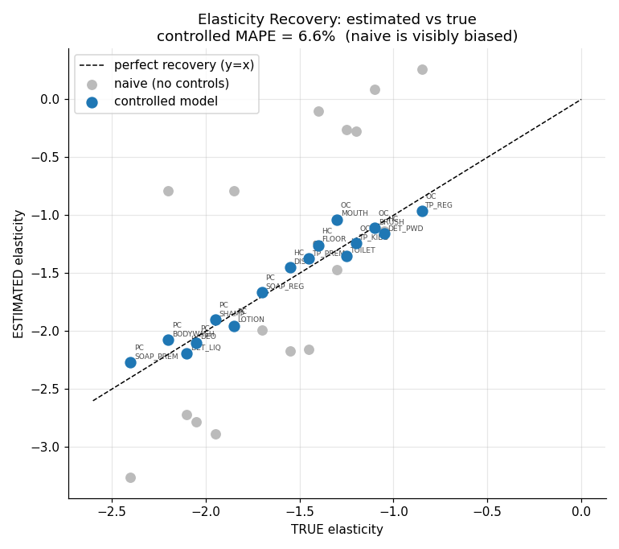

# FMCG Sales & Promotion Analytics

Price elasticity, promotion ROI, cannibalization detection, and demand forecasting for retail/FMCG revenue growth management — validated against a known ground truth.


<!-- Add a dashboard or validation-chart screenshot here before publishing. -->

## Contents
[What this answers](#what-this-answers) · [Business impact](#business-impact-at-a-glance) · [Results detail](#results-detail) · [Pipeline](#pipeline) · [Project structure](#project-structure) · [Quickstart](#quickstart) · [Dataset](#dataset) · [Methodology](#methodology-short-version) · [Power BI dashboard](#power-bi-dashboard) · [Limitations](#limitations) · [Tech stack](#tech-stack)

## What this answers

The questions a revenue growth manager actually asks: which products are price-sensitive, which promotions make money versus burn margin, how much volume a premium SKU steals from its own regular line, and how much to order next quarter.

The data is simulated from a demand model with known elasticities, promo effects, and cannibalization rates, so every model output can be scored against ground truth — something real promotional data never allows. The models never see the true parameters; they recover them from observed sales alone.

## Business impact, at a glance

| Question | Finding |
|---|---|
| Which promos are losing money? | 8 of 9 promo P&L calls correct, including both intentionally loss-making promos (₹6.29M and ₹3.22M losses caught) |
| Is a promoted SKU cannibalizing its sibling? | All 3 known cannibalization pairs detected, within 1.6 pp of true magnitude |
| How price-sensitive is each SKU? | Recovered elasticities within 6.6% of true values — an uncontrolled model misses by 55% and sometimes gets the *direction* wrong |
| How much to order next quarter? | LightGBM forecasts cut error by 28% vs. a seasonal baseline, with the biggest gains on promo-driven SKUs |

**Net takeaway:** a simple uncontrolled read of promo data is actively misleading for pricing decisions — it can flip the sign on elasticity and miss cannibalization entirely. Controlling for seasonality, region, and trend turns the same data into a usable pricing and promo ROI tool.

## Results detail

| Metric | Result | Naive baseline |
|---|---|---|
| Price elasticity recovery (MAPE vs. true) | 6.6% | 55.3% |
| Promo P&L direction correct | 8 / 9 promos | — |
| Cannibalization mean abs. error | 1.6 pp (3/3 pairs detected, p<0.05) | — |
| Promo uplift mean abs. error | 6.5 pp | — |
| Demand forecast MAPE (LightGBM vs. Holt-Winters) | 9.6% vs. 13.4% | 28% lower MAPE |


*Controlled estimates track the line of truth; naive estimates scatter widely.*

## Pipeline

| # | Component | Script | Output |
|---|---|---|---|
| 1 | Synthetic data generation (known ground truth) | `src/simulate.py` | `data/fact_sales.csv`, `dim_product.csv`, `ground_truth.json` |
| 2 | Exploratory analysis | `src/eda.py` | `outputs/eda/` |
| 3 | Elasticity, uplift, cannibalization, P&L + validation | `src/elasticity.py` | `data/elasticity_summary.csv`, `outputs/elasticity/` |
| 4 | Demand forecasting (Holt-Winters vs. LightGBM) | `src/forecasting.py` | `data/forecast_vs_actual.csv`, `outputs/forecasting/` |
| 5 | Power BI exports + DAX guide | `src/export_powerbi.py`, `POWERBI_GUIDE.md` | `powerbi/` |

## Project structure

```
fmcg_project/
├── README.md                  # this file
├── PROJECT_NOTES.md           # detailed write-up + interview pitch
├── POWERBI_GUIDE.md           # dashboard build guide (data model, DAX, pages)
├── requirements.txt
├── run_all.py                 # runs the full pipeline in order
├── src/
│   ├── config.py              # all true parameters (hidden from analysis)
│   ├── simulate.py            # component 1
│   ├── eda.py                 # component 2
│   ├── elasticity.py          # component 3 (core + validation)
│   ├── forecasting.py         # component 4
│   └── export_powerbi.py      # component 5
├── data/                      # generated CSVs + ground_truth.json
├── powerbi/                   # 4 dashboard-ready CSVs
└── outputs/
    ├── eda/                   # charts 01–06
    ├── elasticity/            # charts 07–11 + detail tables
    └── forecasting/           # charts 12–14 + metrics
```

## Quickstart

```bash
pip install -r requirements.txt
python run_all.py

# or run any stage individually, in order:
python src/simulate.py
python src/eda.py
python src/elasticity.py
python src/forecasting.py
python src/export_powerbi.py
```

Then open Power BI Desktop, load the four CSVs from `powerbi/`, and follow [`POWERBI_GUIDE.md`](POWERBI_GUIDE.md).

*Validation integrity: the analysis scripts only ever read `fact_sales.csv` and `dim_product.csv`. The single exception is the validation step in `elasticity.py`, which opens `ground_truth.json` only to score estimates already produced, never to inform them.*

## Dataset

16 SKUs across 3 categories (Oral / Personal / Home Care), 5 regions, 104 weeks (2023–2024), ~8,300 SKU-region-week rows, ~₹2.76B simulated revenue. Ground truth includes per-SKU elasticities, category seasonality, 3 cannibalization pairs, and 2 intentionally loss-making promotions alongside profitable ones.

## Methodology

Demand follows a log-linear model: `log(units) = elasticity·log(price) + seasonality + trend + region + promo_lift + cannibalization + noise`. Price varies independently of promotions (so elasticity isn't confounded with promo lift), and the ground truth for each promo's effect comes from re-running the same noise draws with that promo switched off — an exact counterfactual, not an approximation.

| Task | Method |
|---|---|
| Elasticity | Log-log OLS with seasonality/region/trend controls |
| Promo uplift | Counterfactual baseline fit on non-promo weeks |
| Cannibalization | Aggressor-on-promo dummy in the victim's non-promo weeks |
| Forecasting | Global LightGBM vs. damped Holt-Winters baseline |

Full derivation and design rationale: [`PROJECT_NOTES.md`](PROJECT_NOTES.md).

## Power BI dashboard

Three pages built on the CSVs in `powerbi/` (full build guide: [`POWERBI_GUIDE.md`](POWERBI_GUIDE.md)):
1. Executive Overview — KPI cards, revenue trend, region breakdown
2. Elasticity & Promo Validation — estimated-vs-true scatter, uplift bars, promo ROI matrix
3. Forecast & Suggested Orders — MAPE cards, actual vs. forecast lines, order quantities

## Limitations

- Simulated data — real promotional data has pantry-loading, competitor reactions, and stockouts this doesn't model. The goal here is proving the method before applying it to messier data.
- Uplift is measured within the promo window only; doesn't capture post-promo demand dips.
- Holt-Winters uses a damped-trend approximation since the training window is under two full seasonal cycles.
- Forecasts assume the promo calendar is known in advance — true for planned promotions, the intended use case.

## Tech stack

Python 3.12 · pandas · numpy · statsmodels · LightGBM · scikit-learn · matplotlib · Power BI (DAX)

## Author

Anusha Anil Singh — [GitHub](https://github.com/anushaanilsingh)

## License

MIT
